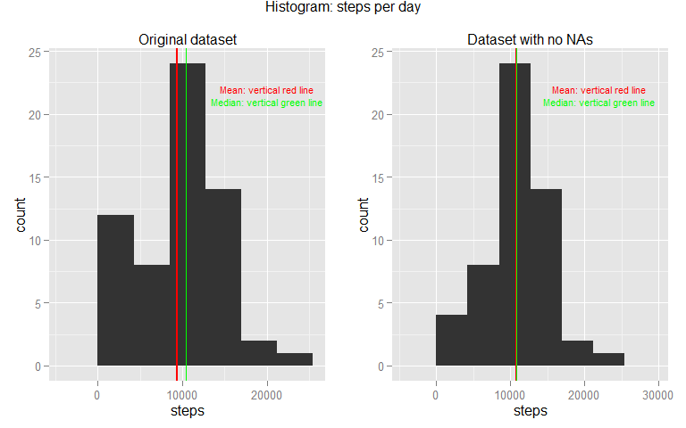
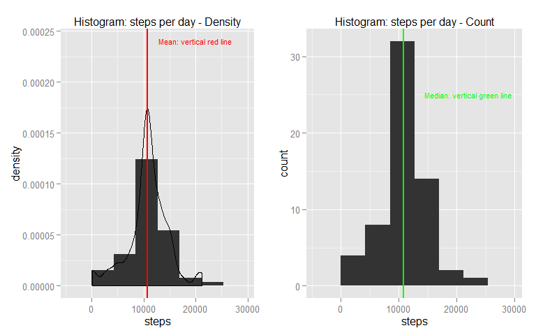

========================================================================================
    


This **assignment** makes use of data from a personal activity monitoring device. This device collects data at `5 minute intervals` through out the day. The data consists of two months of data from an anonymous individual collected during the months of October and November, 2012 and include the number of `steps` taken in `5 minute intervals` each day.  


```r
# Loading libraries
library(plyr)
library(ggplot2)
library(gridExtra)
library(formatR)
library(lubridate)
```
  
  
## Loading and preprocessing the data

```r
# Cleaning working directory
rm(list = ls())

# Reading the data file
data <- read.csv("activity.csv", colClasses = "character")

# Formating the columns/variables
data$steps <- as.numeric(data$steps)
data$date <- as.Date(data$date)
data$interval <- as.numeric(data$interval)

# Eliminating NAs records for the sake of comparing results
goodRds <- complete.cases(data)
dataNoNA <- data[goodRds, ]
```


## Analysis of the data
1. What is the mean of the total number of steps taken per day?


```r
# Grouping the data by day and summing up the steps Using the original data
gpDataOri <- ddply(data, .(date), summarize, steps = sum(steps, na.rm = TRUE))

# Using the data with no NAs
gpData1 <- ddply(dataNoNA, .(date), summarize, steps = sum(steps, na.rm = TRUE))

# Calculating mean & median of the number of steps per day Using the
# original data
meanStepsDayOri <- round(mean(gpDataOri$steps), 2)
medianStepsDayOri <- round(median(gpDataOri$steps), 2)

# Using the data with no NAs
meanStepsDay1 <- round(mean(gpData1$steps), 2)
medianStepsDay1 <- round(median(gpData1$steps), 2)

# Histogram of number of steps per day Using the original data
g1 <- ggplot(gpDataOri, aes(x = steps)) + geom_histogram(aes(y = ..density.., 
    binwidth = 1)) + geom_density() + geom_vline(xintercept = meanStepsDayOri, 
    colour = "red", size = 1) + geom_vline(xintercept = medianStepsDayOri, colour = "green", 
    size = 0.5) + ggtitle("Original dataset") + theme(plot.title = element_text(lineheight = 0.8, 
    size = 12)) + annotate("text", label = "Mean: vertical red line", x = 16000, 
    y = 0.00024, size = 3, colour = "red") + annotate("text", label = "Median: vertical green line", 
    x = 16000, y = 0.00022, size = 3, colour = "green")

# Using the data with no NAs
g2 <- ggplot(gpData1, aes(x = steps)) + geom_histogram(aes(y = ..density.., 
    binwidth = 1)) + geom_density() + geom_vline(xintercept = meanStepsDay1, 
    colour = "red", size = 1) + geom_vline(xintercept = medianStepsDay1, colour = "green", 
    size = 0.5) + ggtitle("Dataset with no NAs") + theme(plot.title = element_text(lineheight = 0.8, 
    size = 12)) + annotate("text", label = "Mean: vertical red line", x = 18000, 
    y = 0.00024, size = 3, colour = "red") + annotate("text", label = "Median: vertical green line", 
    x = 18000, y = 0.00022, size = 3, colour = "green")
```
  
    
    

```r
grid.arrange(g1, g2, ncol = 2, main = "Histogram: steps per day")
```

 
  
    
    
The observed statistics of the total number of steps taken per day are the following:  
  
- Using the original data:  
    - **Mean = ** 9,354  
    - **Median = ** 10,395

- Using the data with no NAs
    - **Mean = ** 10,766
    - **Median = ** 10,765


2.  What is the average daily activity pattern?
  
  
    In this section, the dataset with no NAs was used. 
  
  

```r
# Grouping the data by interval and averaging the steps
gpData2 <- ddply(dataNoNA, .(interval), summarize, MeanStepsInt = mean(steps, 
    na.rm = TRUE))

# Time series plot of average number of steps per interval
g1 <- ggplot(gpData2, aes(x = interval, y = MeanStepsInt))
g1 + geom_line() + ggtitle("Average number of steps per interval")
```

 

```r
maxInt <- gpData2[which.max(gpData2$MeanStepsInt), 1]
maxAvg <- gpData2[which.max(gpData2$MeanStepsInt), 2]
```

The 5-minute interval, on average across all the days in the dataset, that contains the maximum number of steps is the interval **835**, with an average number of steps equal to **206.17**.


3.  Imputing missing values  

    The total number of rows in the original dataset with `NAs` is 2,304.  

    A new dataset was created following the next steps:  

- Copying the original dataset  
- Identifying the rows with `NAs`    
- Replacing the `NAs` with the mean number of steps of the corresponding interval calculated in the previous section 2.  
   
      
  

```r
# Replacing NAs in column 'steps' in a copy of the original dataset
dataNAfill <- data
dataNAfill$indMatch <- match(dataNAfill$interval, gpData2$interval)

dataNAfill$steps <- ifelse(is.na(dataNAfill$steps), gpData2[dataNAfill$indMatch, 
    2], dataNAfill$steps)
```


```r
# Grouping the data by day and summing up the steps
gpData3 <- ddply(dataNAfill, .(date), summarize, steps = sum(steps, na.rm = TRUE))

# Calculating mean & median of number of steps per day
meanStepsDay3 <- round(mean(gpData3$steps), 2)
medianStepsDay3 <- round(median(gpData3$steps), 2)

# Histogram of number of steps per day
g3 <- ggplot(gpData3, aes(x = steps)) + geom_histogram(aes(y = ..density.., 
    binwidth = 1)) + geom_density() + geom_vline(xintercept = meanStepsDay3, 
    colour = "red", size = 1) + ggtitle("Histogram: steps per day - Density") + 
    theme(plot.title = element_text(lineheight = 0.8, size = 12)) + annotate("text", 
    label = "Mean: vertical red line", x = 18000, y = 0.00024, size = 3, colour = "red")

g4 <- ggplot(gpData3, aes(x = steps)) + geom_histogram(aes(y = ..count.., binwidth = 1)) + 
    geom_vline(xintercept = medianStepsDay3, colour = "green", size = 1) + ggtitle("Histogram: steps per day - Count") + 
    theme(plot.title = element_text(lineheight = 0.8, size = 12)) + annotate("text", 
    label = "Median: vertical green line", x = 18000, y = 10, size = 3, colour = "green")
```


```r
grid.arrange(g3, g4, ncol = 2)
```

 
  
  
For the new dataset, where the `NAs` where replaced, the observed statistics are:  

- **Mean = ** 10,766
- **Median = ** 10,766  
         
As it can be seen, these values differ from the estimates from the first part of the assignment if we consider the original dataset, but they are very close to the ones where the `NAs` where eliminated. Thus, we can conclude that imputing missing data on the estimates of the total daily number of steps, reduces the mean and the median, since the `NAs` are considered as `zeroes`. The following plot summarizes the results.
  

```r
# Using the original data
g5 <- ggplot(gpDataOri, aes(x = steps))

g5 + geom_histogram(aes(y = ..density.., binwidth = 1)) + geom_density() + geom_vline(xintercept = meanStepsDayOri, 
    colour = "red", size = 1) + geom_vline(xintercept = meanStepsDay1, colour = "green", 
    size = 2) + geom_vline(xintercept = meanStepsDay3, colour = "blue", size = 0.7) + 
    theme(plot.title = element_text(lineheight = 0.8, size = 12)) + annotate("text", 
    label = "Mean using the original dataset", x = 16000, y = 0.00024, size = 3, 
    colour = "red") + annotate("text", label = "Mean using dataset without NA", 
    x = 16000, y = 0.00022, size = 3, colour = "green") + annotate("text", label = "Mean using the dataset with NAs filled", 
    x = 16000, y = 0.0002, size = 3, colour = "blue") + ggtitle("Histogram of the number of steps per day - original dataset")
```

 

4.  Are there differences in activity patterns between weekdays and weekends?

    Using the dataset with the filled-in missing values from the previous section 3, the activity patterns between weekdays and weekends was analyzed by doing the following:  
    
- Creating a new factor variable in the dataset with two levels: "weekday" and "weekend" to indicate whether a given date is a "weekday" or a "weekend" day.
- Grouping the data by type of day ("weekday", "weekend") and interval
- Calculating the mean of the number of steps per interval, accross all "weekday" or  "weekend" days.
    
    

```r
# Creating the new factor variable
dataNAfill$tpDay <- factor(ifelse(wday(dataNAfill$date) %in% c(1, 7), "weekend", 
    "weekday"))

# Grouping by tpDay and interval and calculating the mean
gpData4 <- ddply(dataNAfill, .(tpDay, interval), summarize, MeanStepsInt = mean(steps, 
    na.rm = TRUE))

# Time series plot of the average number of steps per interval
g6 <- ggplot(gpData4, aes(x = interval, y = MeanStepsInt))
g6 + geom_line() + ggtitle("Average number of steps per interval") + facet_wrap(~tpDay, 
    ncol = 1)
```

 


```r
# Identifying the intervals with the maximum number of steps
Data4wday <- subset(gpData4, tpDay == "weekday")
Data4wend <- subset(gpData4, tpDay == "weekend")

maxIntwday <- Data4wday[which.max(Data4wday$MeanStepsInt), 2]
maxAvgwday <- Data4wday[which.max(Data4wday$MeanStepsInt), 3]

maxIntwend <- Data4wend[which.max(Data4wend$MeanStepsInt), 2]
maxAvgwend <- Data4wend[which.max(Data4wend$MeanStepsInt), 3]
```


The **5-minute intervals**, on average across all `weekday` or `weekend` days in the dataset, that contain the maximum number of steps are: 
  
- For `weekday` days: **835**
- For `weekend` days: **915**

With an **average** number of steps equal to:
  
- For `weekday` days: **230.38**
- For `weekend` days: **166.64**

